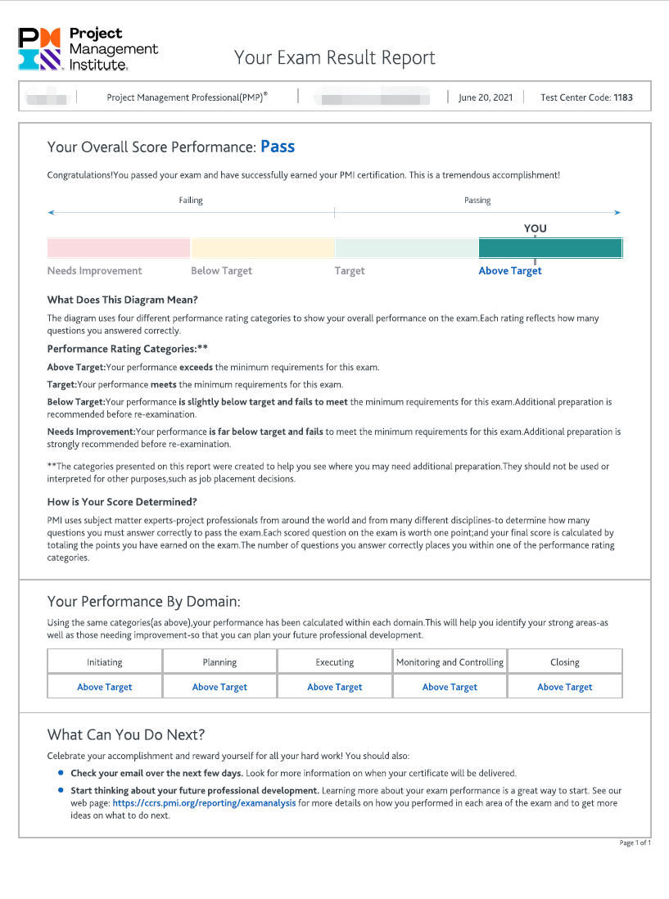
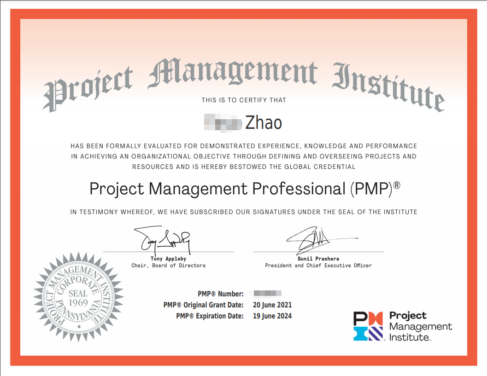

# 2106PMP

## 为什么要写这篇文档
1. 复盘学习PMP的过程
2. 抛砖引玉，分享备考经验给需要的人

## 目录

  - [一、先晒下成绩单](#一先晒下成绩单)
  - [二、我为什么要学PMP](#二我为什么要学pmp)
  - [三、学习过程](#三学习过程)
  - [四、备考过程](#四备考过程)
  - [五、PMP带给我什么](#五pmp带给我什么)
  - [六、结束语](#六结束语)

## 一、先晒下成绩单
2021年7月28日早上5点16分，在经历了将近40天的漫长等待后，我终于收到了PMI发来的邮件。祝贺二字隐隐意味着我通过了考试，激动的心，颤抖的手，迫不及待地点开成绩单，不负所望，果然是5A。终于结束了，也算对得起这几个月付出的时间了。以后，咱也是有证的人啦！

## 二、我为什么要学PMP
身边挺多朋友问我关于PMP的事情，而且，大家的问题都惊人地一致。
* “PMP是干嘛的啊？好考不？”
* “这个证书有什么用？可以升职加薪吗？”

而我的回答也始终如一。
- “项目管理的一个认证。还行吧，不算难，但还是要花点精力准备。”
- “有什么用我也不知道，但，升职加薪估计是没戏的。”

**可能你会接着问，那你为什么要学PMP呢？** 认真思考过后，我觉得主要还是因为闲的。。。

没错，我是一枚水货程序员，我司以“不加班”著称。工作的头两年，我曾毫不犹豫地一头扎进了电视剧的海洋，什么都市言情，古装穿越，军旅谍战，总之，能看的我几乎都看了。没办法，谁让咱不用加班呢？看了两年电视剧后，我发觉孔子说的挺对的，“学而不思则罔”，我看了这么多电视剧，又能得到啥呢？是逐渐隆起的小腹还是日渐丰腴的躯体？

不行，我不能这样下去了，我要找点事情做。那，不如考个证？

**当然，可以考的证很多，我为什么选择PMP呢？** 仔细想了想，好像还是因为闲的。。。

没错，我司不仅不加班，还鼓励员工参加各种内部创新大赛。于是乎在工作的第三个年头，水货程序员终于没忍住，团结了几枚同事上场了。

比赛很激烈，从6月到8月；从初赛到复赛，再到半决赛，决赛。作为参赛队伍之一，我们就这样一直跟着主办方的节奏在走，直到半决赛结束后的某一天。

这一天，我们突然被要求在下次比赛中提供PoC，而此时，距离下次比赛只有3天了。我们拼尽全力做了几个UI页面，却还是因为制作不够精良而无缘决赛。时间太短了，我们的需求还没有收集清楚。

主办方有自己的节奏，我们是不是也应该有自己的节奏，而不是完全跟随别人的脚步？嗯，如果把这次比赛作为一个项目的话，我们没有明确的项目管理计划，其实，我还不知道应该如何制定项目管理计划。那，不如学个PMP?

## 三、学习过程
| 占位符 | 占位符 | 占位符 |
 | --- | --- | --- |
 | --------------------占位符-------------------- |
 | A | B | C |

## 四、备考过程
*

## 五、PMP带给我什么
-

## 六、结束语