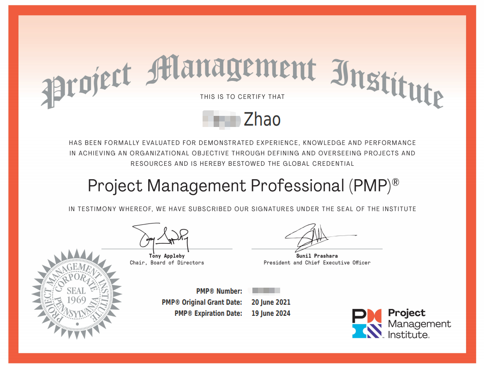

# 2106PMP

## 为什么要写这篇文档
1. 复盘学习PMP的过程
2. 抛砖引玉，分享经验给需要的人

## 目录

  - [一、先晒下成绩单](#一先晒下成绩单)
  - [二、我为什么要学PMP](#二我为什么要学pmp)
  - [三、学习过程](#三学习过程)
  - [四、备考过程](#四备考过程)
  - [五、PMP带给我什么](#五pmp带给我什么)
  - [六、结束语](#六结束语)

## 一、先晒下成绩单
2021年7月28日早上5点16分，在经历了将近40天的漫长等待后，我终于收到了PMI发来的邮件。祝贺二字隐隐意味着我通过了考试，激动的心，颤抖的手，迫不及待地点开成绩单，不负所望，果然是5A。终于结束了，也算对得起这几个月付出的时间了。以后，咱也是有证的人啦！

## 二、我为什么要学PMP
身边挺多朋友问我关于PMP的事情，而且，大家的问题都惊人地一致。
* “PMP是干嘛的啊？好考不？”
* “这个证书有什么用？可以升职加薪吗？”

而我的回答也始终如一。
- “项目管理的一个认证。还行吧，不算难，但还是要花点精力准备。”
- “有什么用我也不知道，但，升职加薪估计是没戏的。”

**可能你会接着问，那你为什么要学PMP呢？** 认真思考过后，我觉得主要是因为闲的。。。

没错，我是一枚水货程序员，我司以“不加班”著称。工作的头两年，我曾毫不犹豫地一头扎进了电视剧的海洋，什么都市言情，古装穿越，军旅谍战，总之，能看的我几乎都看了。没办法，谁让咱不用加班呢？看了两年电视剧后，我发觉孔子说的挺对的，“学而不思则罔”，我看了这么多电视剧，又能得到啥呢？是逐渐隆起的小腹还是日渐丰腴的躯体？

不行，我不能这样下去了，我要找点事情做。那，不如考个证？

**当然，可以考的证很多，我为什么选择PMP呢？** 仔细想了想，好像还是因为闲的。。。

没错，我司不仅不加班，还鼓励员工参加各种内部创新大赛。于是乎在工作的第三个年头，水货程序员终于没忍住，团结了几枚同事上场了。

比赛很激烈，从6月到8月；从初赛到复赛，再到半决赛，决赛。作为参赛队伍之一，我们就这样一直跟着主办方的节奏在走，直到半决赛结束后的某一天。

这一天，我们突然被要求在下次比赛中提供PoC，而此时，距离下次比赛只有3天了。我们拼尽全力做了几个UI页面，却还是因为制作不够精良而无缘决赛。时间太短了，我们的需求还没有收集清楚。

主办方有自己的节奏，我们是不是也应该有自己的节奏，而不是完全跟随别人的脚步？嗯，如果把这次比赛作为一个项目的话，我们没有明确的项目管理计划，其实，我还不知道应该如何制定项目管理计划。那，不如学个PMP?

**吾之蜜糖，彼之砒霜。** 以上，也只是我的想法，至于，你为什么要学PMP，这个问题还是得你亲自找答案了。

## 三、学习过程
有了学习的想法后，你的下一步行动会是什么呢？在IT界，我们有一个公认的 “Read - Search - Ask” 准则，什么意思呢？就是遇到问题先看文档，找不到思路的话就去Google，还是没有头绪的话就可以求助大牛了。我觉得这个准则是很好的，无论是开发小白还是技术大牛都可以从中受益。

但是，非技术问题的话，我认为可以先Ask，站在巨人的肩膀上，总是可以看得更远的。

抱着这样的想法，我马上找到了我的同事凯文，他不仅送了我几本书，还很热心地告诉我他并不推荐他之前上的那个培训班。哈哈，可也太实诚了。。。于是乎，我立刻想到之前在朋友圈看到的5A截图，凯文又说如果这个机构5A率高的话，就选这个吧！我便毫不犹豫地添加了课程顾问的微信，经过询问得知，**乐凯的5A通过率居然高达50%+**，那还想啥？就它了！！！

乐凯的培训课程分为两类：
- 面授班（在上海的童鞋，会有以下几个上课地点可供选择）
  - 人广
  - 徐汇
  - 五角场
  - 莘庄
  - 浦东
- 远程班
  - 上课时间：考前三个月开始安排，每周一、三、六晚20:00-22:00
  - 上课平台：钉钉直播群

考虑到这个课程确实趣味性不强，加之本人自控能力也很一般，我还是选择了面授课程。总共7节线下课，会占用7个周六/日白天，课表大致如下：

| 课次 | 章节 | 内容 |
 | --- | --- | --- |
 | -------------------- |仅供参考|--------------------|
 | 第一课 | 1-4 章 | 引论、项目运行环境、项目经理的角色、项目整合管理 |
 | 第二课 | 5-6 章 | 项目范围管理、项目进度管理、单元测试一 |
 | 第三课 | 7-8 章 | 项目成本管理、项目质量管理、单元测试二 |
 | 第四课 | 9-11 章 | 项目资源管理、项目沟通管理、项目风险管理、单元测试三 |
 | 第五课 | 12-13 章 | 项目采购管理、项目相关方管理、单元测试四 |
 | 第六课 | | 模拟考试 |
 | 第七课 | | 模拟考试 |

 总的来说，我觉得这个课程设置还是很合理的，每周末上一天课，也说得过去。三次模拟考试（两次线上+一次线下）也基本满足大多数人的需求。

 所有的章节内容结束之后，老师会安排每晚一小时的**在线复习课**，系统性地回顾全书内容，并重点讲解计算题和PMP中的敏捷。复习 + 模拟考试，随时检验自己的复习成效。做过一套模拟题之后，老师还会以模拟习题为例给大家讲解**解题思路**；接下来的模拟中，正好可以检验下刚掌握的解题思路。**实践  + 理论 + 实践**，想不拿高分都拿。

 亲自学过一轮后，我认为**乐凯有以下几点做得很好**：
  1. **课前复习**，没错，就是复习。每次课开始前，老师会带领大家一起复习上节课的内容，温故而知新，可以为师矣。
  2. **课后回顾**，每次课结束前，老师会带领大家回顾今日所学，能够现场把所学内容消化吸收自然是效率最高的方式。
  3. **单元测试**，每次课上会针对上次课所学内容进行单元测试，倒逼大家课前主动复习。
  4. **在线习题**，教务老师精心准备了每日一练和每周练习，practice makes perfect!
  5. **同学互助**，乐凯营造了一种互相信任，知识分享的氛围，同学们在微信群里交流困惑，互帮互助。
  6. **考前集训**，正式考试前两周，老师会开一系列线上复习课，带领大家从全局理解整本书，并传授考试技巧。个人认为这部分帮助非常大。

**其实，只要认真听课，跟着老师的节奏走，考试结果都不会差。** 更重要的是能否享受学习的过程，收获证书之外的东西。

## 四、备考过程
如果你知道不久后要参加一场考试，你会先做什么？我的话，当然是先了解下考试形式了。“知己知彼，百战不殆”永远是亘古不变的道理。

我参加的是改版前（旧考纲）的考试，考试时长4小时（9:00AM - 1:00PM），共计200道单选题，笔试，需要涂答题卡。考场会发文具，包括涂卡笔、橡皮、计算器。

据说改版后（新考纲）的考试增加了定向多选题，具体的考试形式培训机构肯定了解的更清楚。如果可以的话，我建议还是要尽可能早地了解考试形式，做到有的放矢。

备考过程主要集中在考试前三周。

## 五、PMP带给我什么
-

## 六、结束语